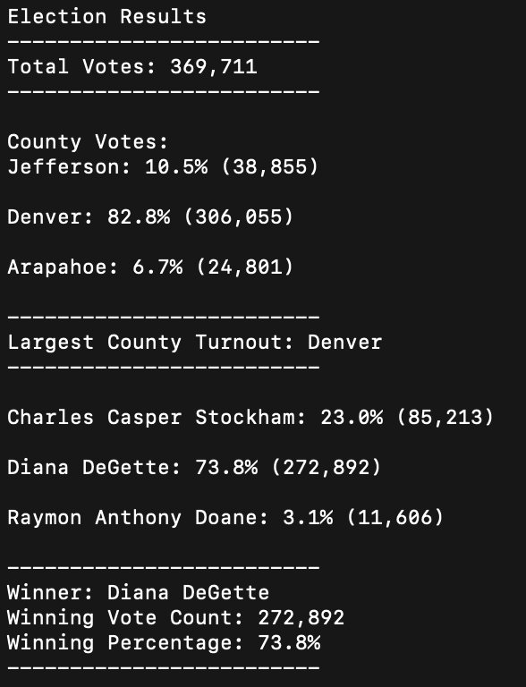

# Overview of Election Audit
The goal of this project is to summarize a set of voting data across three counties and across three potential candidates.  The necessary outcomes are to find the winner of the election across all counties, the county with the highest turnout, and summaries of candidate and voter turnout records by county.  The summary output needs to be printed to both the terminal and to a text output file.  

## Election-Audit Results

The summary output can be seen in the following image, capture from the terminal output.  A breakdown of how each piece was derived is below the image.  

- ### How many votes were cast in this congressional election?
    - Result:  369,711
    - Process: Define a variable (total_votes), set it to 0 initially, and then include a counter that increments by 1 for each row of vote count data

            for row in reader:
                # Add to the total vote count
                total_votes = total_votes + 1
- ### Number of votes and the percentage of total votes for each county in the precinct
    - Result:
        - Jefferson: 10.5% (38,855)
        - Denver: 82.8% (306,055)
        - Arapahoe: 6.7% (24,801)
    - Process: To summarize data by county, there are multiple steps involved
        1. Create a list (county_list) to store the different county names

                county_list = []

        1. Define where in header row to extract county name data (using index)

                county_name = row[1]
        1. As new county names are encountered by row, add them (append) to the county name list

                if county_name not in county_list:
                county_list.append(county_name)

        1. As new county names are added, beging tracking their votes within each county, incrementing by 1 for each found row

                    county_votes[county_name] = 0

                county_votes[county_name] += 1

- ### Which county had the largest number of votes?
    - Results: Denver
    - Process: 

        1. Write a for loop to get the county from the county dictionary and retrieve the vote count.
            
                for county_name in county_votes:
                    votes = county_votes.get(county_name)
        
        1. Calculate the percentage of votes for the county.
        
                vote_percentage = float(votes) / float(total_votes) * 100
                county_results = (
                    f"{county_name}: {vote_percentage:.1f}% ({votes:,})\n")
        
        1. Write an if statement to determine the winning county and get its vote count.
        
                if (votes > largest_county) and (vote_percentage > turnout_percentage):
                    largest_county = votes
                    winning_county = county_name
                    turnout_percentage = vote_percentage

- ### Number of votes and the percentage of the total votes each candidate received.
    - Results: 
        - Chales Casper Stockham: 23.0% (85,213)
        - Diana DeGette: 73.8% (272,892)
        - Raymon Anthony Doane: 3.1% (11,606)
    - Process: The steps were similar to the above process in determing county totals and percentages, but with a focus on the Candidate column of data instead of County.  

### Which candidate won the election, what was their vote count, and what was their percentage of the total votes?
- Results: Diana DeGette won the election, receiving 73.8% (272,892) of total votes
- Process: Again, this process was similar with how the highest county voter turnout was arrived at.  However, the code was slightly different since it didn't focus on a county level breakout for the overall winner of the election.

        for candidate_name in candidate_votes:

            votes = candidate_votes.get(candidate_name)
            vote_percentage = float(votes) / float(total_votes) * 100
            candidate_results = (
                f"{candidate_name}: {vote_percentage:.1f}% ({votes:,})\n")

            if (votes > winning_count) and (vote_percentage > winning_percentage):
                winning_count = votes
                winning_candidate = candidate_name
                winning_percentage = vote_percentage

## Election-Audit Summary

### The steps followed in this code could be used to derive the outcome of any election, since the basice pseudocode would be the same:
    
1. Count up the total votes by candidate to find the winner (can also summarize the percentage of votes as well as absolute total vote count)
1. Tally up the votes by county to find where the highest turnout occurred (similarly, this can be expressed as a percentage or total vote count)
### There may be difference in how this data is captured (for example, if header rows for County and Candidate are ordered differently) but this could be overcome by updating the index columns to reflect the new locations of those categories.  Additionally, the code could be refactored to find where those columns exist, if the naming conventions for County and Candidate remains the same (i.e. a step could be added to find what the index locations would be for the Candidate and County headers).

### With this use case being a very common need across other elections, there is an opportunity to provide this code (for a fee, of course!) to other election committees to help streamline their vote counting process.  With the need to potentially refactor code to reflect the nuances of different elections, there is also the opportunity to collect consulting fees to adjust the code accordingly.  

